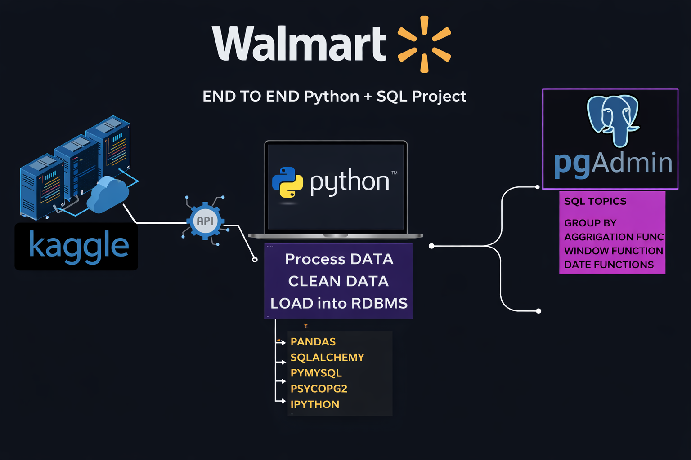

# 🛒 Walmart Sales Data Analysis Pipeline

<p align="center">
  
</p>

---

## 🚀 Project Summary
This project is a complete **end-to-end data analysis pipeline** designed to extract actionable business insights from Walmart sales data. It demonstrates a professional workflow: 
**Data Collection ➡️ Cleaning ➡️ Feature Engineering ➡️ Database Ingestion ➡️ SQL Analysis ➡️ Business Insights.**

By combining **Python** for automated ETL and **PostgreSQL** for deep-dive analytical querying, this project solves 9+ specific business problems regarding branch performance, customer behavior, and revenue trends.

---

## 🧰 Tech Stack
| Tool | Purpose |
|------|--------|
| **Python (Pandas, NumPy)** | Data Cleaning, Transformation & Feature Engineering |
| **PostgreSQL (pgAdmin)** | Relational Data Storage & Advanced SQL Analysis |
| **SQLAlchemy** | Seamless Database Connection & Ingestion |
| **Kaggle API** | Automated Dataset Retrieval |
| **VS Code** | Primary Development Environment |

---

## 🔄 Complete Workflow

### 1. Data Collection & Setup
* Integrated **Kaggle API** for programmatic dataset downloads.
* Set up a structured local environment with `data/`, `notebooks/`, and `sql_queries/` folders.

### 2. ETL (Extract, Transform, Load)
* **Cleaning:** Removed duplicates, handled missing values, and standardized currency/date formats.
* **Feature Engineering:** Created new metrics like `Total_Amount` ($unit\_price \times quantity$) and extracted time-based features (Hour, Day, Month).
* **Ingestion:** Automated the process of pushing cleaned data from a Pandas DataFrame into a **PostgreSQL** table using `SQLAlchemy`.

---

## 🔍 SQL Analysis (Business Problems Solved)

The core of this project involves solving specific business questions using optimized PostgreSQL queries.

### Q1: Payment Method Performance
**Objective:** Find the volume of transactions and total quantity sold per payment method.
```sql
SELECT 
    payment_method,
    COUNT(*) AS no_payments,
    SUM(quantity) AS no_qty_sold
FROM walmart
GROUP BY payment_method;

```

### Q.2 Identify the highest-rated category in each branch, displaying the branch, category AVG RATING
```sql
SELECT * FROM (
	SELECT branch, category, AVG(rating) AS avg_rating,
	RANK() OVER(PARTITION BY branch ORDER BY AVG(rating) DESC)
	FROM walmart
	GROUP BY 1, 2
	ORDER BY 1, 3 DESC
)
WHERE RANK = 1;
```
### Q.3 Identify the busiest day for each branch based on the number of transactions

```sql
SELECT * FROM (
	SELECT branch , 
	TO_CHAR(TO_DATE(date, 'DD/MM/YY'), 'Day') AS day_name,
	COUNT(*) AS no_of_transactions,
	RANK() OVER(PARTITION BY branch ORDER BY COUNT(*) DESC) AS rank
	FROM walmart
	GROUP BY 1,2
	ORDER BY 1,3 DESC
)
WHERE RANK = 1;

```
### Q.4 Calculate the total quantity of items sold per payment method. List payment_method and total_quantity.
```sql
SELECT payment_method, SUM(quantity) AS total_quantity
FROM walmart
GROUP BY payment_method

```
### Q.5 Determine the average, minimum, and maximum rating of category for each city. List the city, average_rating, min_rating, and max_rating.

```sql
SELECT city,category,
MIN(rating) AS min_rating,
MAX(rating) AS max_rating,
AVG(rating) AS avg_rating
FROM walmart
GROUP BY 1,2

```
### Q.6 Calculate the total profit for each category by considering total_profit as (unit_price * quantity * profit_margin). List category and total_profit, ordered from highest to lowest profit.

```sql
SELECT category ,
SUM(totals) AS total_revenue,
SUM(totals * profit_margin) AS profit
-- SUM(unit_price * quantity * profit_margin) AS profit
FROM walmart
GROUP BY 1

```
### Q.7 Determine the most common payment method for each Branch. Display Branch and the preferred_payment_method.

```sql
WITH cte
AS
	(SELECT branch,payment_method,
	COUNT(*) AS total_trans,
	RANK() OVER(PARTITION BY branch ORDER BY COUNT(*) DESC) AS rank
	FROM walmart
	GROUP BY 1, 2)
SELECT * FROM cte
WHERE RANK = 1

```
### Q.8 Categorize sales into 3 group MORNING, AFTERNOON, EVENING .Find out each of the shift and number of invoices 

```sql
SELECT branch,
CASE
	WHEN EXTRACT(HOUR FROM(time::time)) < 12 THEN 'Morning'
	WHEN EXTRACT(HOUR FROM(time::time)) BETWEEN 12 AND 17 THEN 'Afternoon'
	ELSE 'Evening'
END day_time,
COUNT(*)
FROM walmart
GROUP BY 1,2
ORDER BY 1, 3 DESC

```
### Q.9 Identify 5 branch with highest decrese ratio in revevenue compare to last year(current year 2023 and last year 2022)

```sql

WITH revenue_2022
AS
(
	SELECT branch,
	SUM(totalS) AS revenue
	FROM walmart
	WHERE EXTRACT(YEAR FROM TO_DATE(date, 'DD/MM/YY')) = 2022
	GROUP BY 1
),

revenue_2023
AS
(
	SELECT branch,
	SUM(totals) AS revenue
	FROM walmart
	WHERE EXTRACT(YEAR FROM TO_DATE(date, 'DD/MM/YY')) = 2023
	GROUP BY 1
)

SELECT lst.branch ,
lst.revenue AS last_year_rev,
cur.revenue AS current_year_rev,
ROUND(
(lst.revenue - cur.revenue)::NUMERIC / lst.revenue::NUMERIC * 100,
2
) AS rev_dec_ratio

FROM revenue_2022 AS lst
JOIN 
revenue_2023 AS cur
ON lst.branch = cur.branch
WHERE lst.revenue > cur.revenue
ORDER BY 4 DESC
LIMIT 5

```
